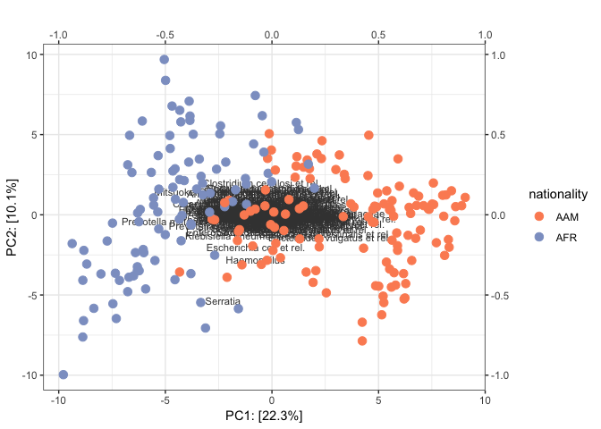
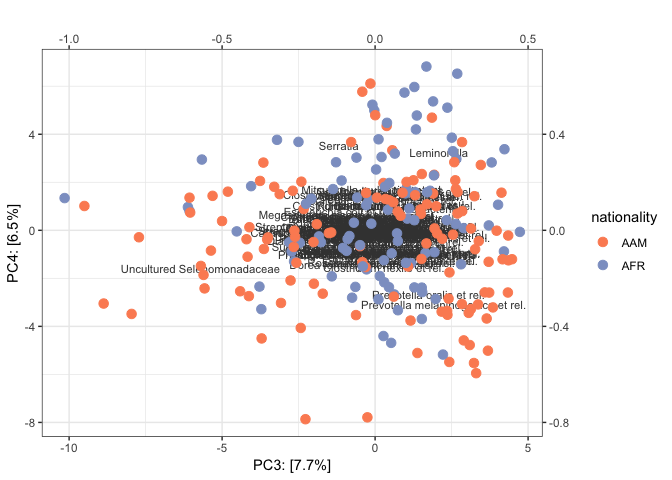
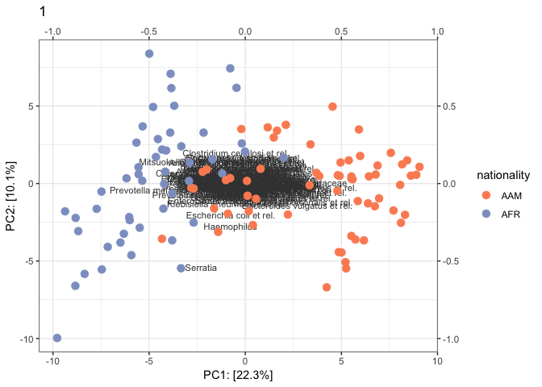
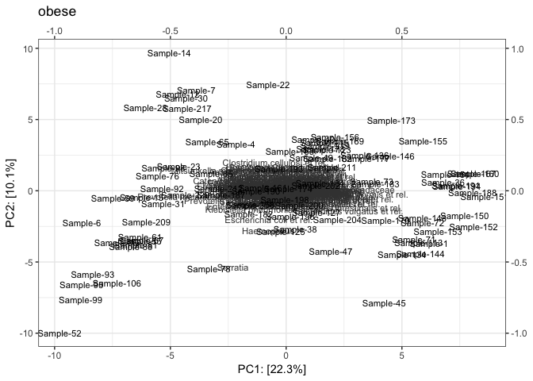
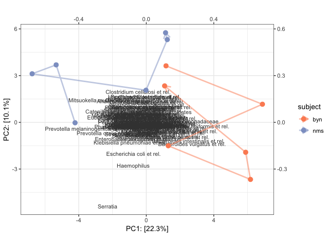

Beta-Diversity: The compositional biplot
----------------------------------------

The compositonal biplot is based on singular value decomposition of clr-tranformed compositional data and includes both samples and OTUs. It can be seen as a replacement for principle coordinate plots based on Unifrac or Bray-Curtis difference measures (see Gloor, Wu, Pawlowsky-Glahn, & Egozcue (2016) for further explanation). It very well serves as an initial exploratory tool since we can explore for separate groups, identify OTUs that vary highly between groups and identify OTUs that are associated with each other (with some limitations as outlined by Gloor et al. (2016))

Create biplots
--------------

The function *biplot* takes a phyloseq object of clr-transformed data as input and returns a list of plots. By default 2 plots showing the first 4 principal components are returned. There are several options to explore groups and also track individual change in microbiota composition over time. In the following such examples are shown with further explanations.

``` r
library(microbiome)
library(tidyverse)
source("https://raw.githubusercontent.com/HenrikEckermann/in_use/master/mb_helper.R")


#import data and apply clr transformation 
data(dietswap)
pseq_clr <- transform(dietswap, transform = "clr")
```

By default the function displays the samples in respect to the first 4 principal components in addition to the factor loadings of the taxa. The top and the right axis of the plots belong to the factor loadings of taxa. We might want to change the default downscaling factor of 10. For example:

``` r
scale_10 <- biplot(pseq_clr)
scale_30 <- biplot(pseq_clr, scaling_factor = 30)
scale_10[[1]]
```


``` r
scale_30[[1]]
```


We have several opportunities to split the data by grouping factors. See the comments:

``` r
# grouping by color:
biplot(pseq_clr, color = "nationality")
```

    ## [[1]]



    ## 
    ## [[2]]



``` r
# grouping by color and facetting 
biplot(pseq_clr, color = "nationality", facet = "timepoint.within.group")
```

    ## [[1]]


    ## 
    ## [[2]]



``` r
# we might want to see bigger plots and avoid facetting. See the title of
# the plot to identify the group, here timepoint.within.group:
biplot(pseq_clr, color = "nationality", split_by = "timepoint.within.group")
```

    ## [[1]]



    ## 
    ## [[2]]


    ## 
    ## [[3]]


    ## 
    ## [[4]]


``` r
# we can identify the samples using the text option:
biplot(pseq_clr, color = "nationality", split_by = "bmi_group", text = TRUE)
```

    ## [[1]]


    ## 
    ## [[2]]


    ## 
    ## [[3]]


    ## 
    ## [[4]]


    ## 
    ## [[5]]


    ## 
    ## [[6]]


Inspect composition over time
-----------------------------

Finally, we can predefine a subset of sample IDs. This can be helpful to inspect the development of few individuals over time. Inspecting all individuals over time in one plot can be impossible in large datasets due to overflow of information on the plot. If we want to inspect the development of two individuals over time we can do it as follows: We first define all sample IDs belonging to those subjects and then pass the sample IDs to the argument "filter\_samples" in the *biplot* function. To inspect development over time we need to provide the column name of the timepoint variable to the argument "connect\_series". Note that to achieve reasonable output, it must be assured that also "subject\_id" is defined correctly. The function assumes that the corresponding column name is "subject\_id". You might need to manually change it to the column name used in your phylosec sample data that identifies subjects (or samples sites in general).

``` r
# First I need to subset the data. Here I do it outside of the phyloseq object 
# but it can also be done in different ways as long as you obtain the
# subject IDs.
meta <- sd_to_df(pseq_clr)
meta %>% head() %>% kable()
```

| sample\_id | subject | sex    | nationality | group | sample   |  timepoint|  timepoint.within.group| bmi\_group |
|:-----------|:--------|:-------|:------------|:------|:---------|----------:|-----------------------:|:-----------|
| Sample-1   | byn     | Male   | AAM         | DI    | Sample-1 |          4|                       1| obese      |
| Sample-2   | nms     | Male   | AFR         | HE    | Sample-2 |          2|                       1| lean       |
| Sample-3   | olt     | Male   | AFR         | HE    | Sample-3 |          2|                       1| overweight |
| Sample-4   | pku     | Female | AFR         | HE    | Sample-4 |          2|                       1| obese      |
| Sample-5   | qjy     | Female | AFR         | HE    | Sample-5 |          2|                       1| overweight |
| Sample-6   | riv     | Female | AFR         | HE    | Sample-6 |          2|                       1| obese      |

``` r
# select any number of individuals that we want to look at:
two_individuals <- meta %>% filter(subject %in% c("byn", "nms"))
two_individuals %>% kable()
```

| sample\_id | subject | sex  | nationality | group | sample     |  timepoint|  timepoint.within.group| bmi\_group |
|:-----------|:--------|:-----|:------------|:------|:-----------|----------:|-----------------------:|:-----------|
| Sample-1   | byn     | Male | AAM         | DI    | Sample-1   |          4|                       1| obese      |
| Sample-2   | nms     | Male | AFR         | HE    | Sample-2   |          2|                       1| lean       |
| Sample-10  | nms     | Male | AFR         | HE    | Sample-10  |          3|                       2| lean       |
| Sample-18  | nms     | Male | AFR         | DI    | Sample-18  |          4|                       1| lean       |
| Sample-26  | nms     | Male | AFR         | DI    | Sample-26  |          5|                       2| lean       |
| Sample-40  | byn     | Male | AAM         | ED    | Sample-40  |          1|                       1| obese      |
| Sample-49  | byn     | Male | AAM         | ED    | Sample-49  |          6|                       2| obese      |
| Sample-127 | byn     | Male | AAM         | HE    | Sample-127 |          3|                       2| obese      |
| Sample-148 | byn     | Male | AAM         | DI    | Sample-148 |          5|                       2| obese      |
| Sample-154 | byn     | Male | AAM         | HE    | Sample-154 |          2|                       1| obese      |
| Sample-207 | nms     | Male | AFR         | ED    | Sample-207 |          1|                       1| lean       |
| Sample-215 | nms     | Male | AFR         | ED    | Sample-215 |          6|                       2| lean       |

``` r
# now we can use biplot:
biplot(
  pseq_clr, 
  connect_series = "timepoint", 
  filter_samples = two_individuals$sample_id,
  color = "subject",
  subject_id = "subject"
)
```

    ## [[1]]



    ## 
    ## [[2]]


More examples using the atlas data
----------------------------------

``` r
data(atlas1006)
pseq_clr <- transform(atlas1006, transform = "clr")
meta <- atlas1006 %>% sd_to_df()
head(meta) %>% kable()
```

| sample\_id |  age| gender | nationality | DNA\_extraction\_method | project |  diversity| bmi\_group  | subject |  time| sample   |
|:-----------|----:|:-------|:------------|:------------------------|:--------|----------:|:------------|:--------|-----:|:---------|
| Sample-1   |   28| male   | US          | NA                      | 1       |       5.76| severeobese | 1       |     0| Sample-1 |
| Sample-2   |   24| female | US          | NA                      | 1       |       6.06| obese       | 2       |     0| Sample-2 |
| Sample-3   |   52| male   | US          | NA                      | 1       |       5.50| lean        | 3       |     0| Sample-3 |
| Sample-4   |   22| female | US          | NA                      | 1       |       5.87| underweight | 4       |     0| Sample-4 |
| Sample-5   |   25| female | US          | NA                      | 1       |       5.89| lean        | 5       |     0| Sample-5 |
| Sample-6   |   42| male   | US          | NA                      | 1       |       5.53| lean        | 6       |     0| Sample-6 |

``` r
# since the output is a list of ggplot objects, 
# we can easily add layers or change theme as usual
list_of_plots <- biplot(pseq_clr, color = "nationality")

list_of_plots[[1]] + theme_void()
```


``` r
# or to all plots at once:
map(list_of_plots, ~.x + theme_classic())
```

    ## [[1]]


    ## 
    ## [[2]]


References
----------

Gloor, G. B., Wu, J. R., Pawlowsky-Glahn, V., & Egozcue, J. J. (2016). It’s all relative: Analyzing microbiome data as compositions. *Annals of Epidemiology*, *26*(5), 322–329. <https://doi.org/10.1016/j.annepidem.2016.03.003>
